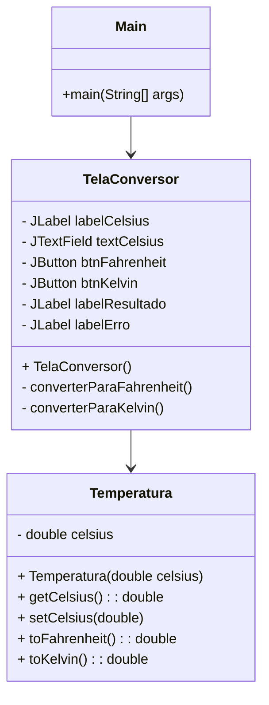
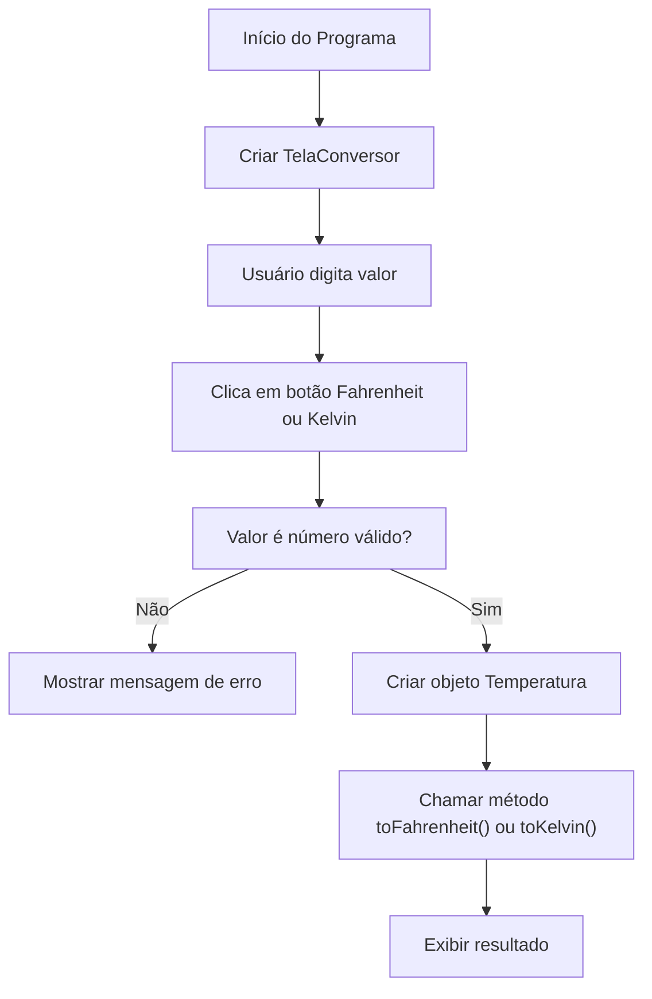
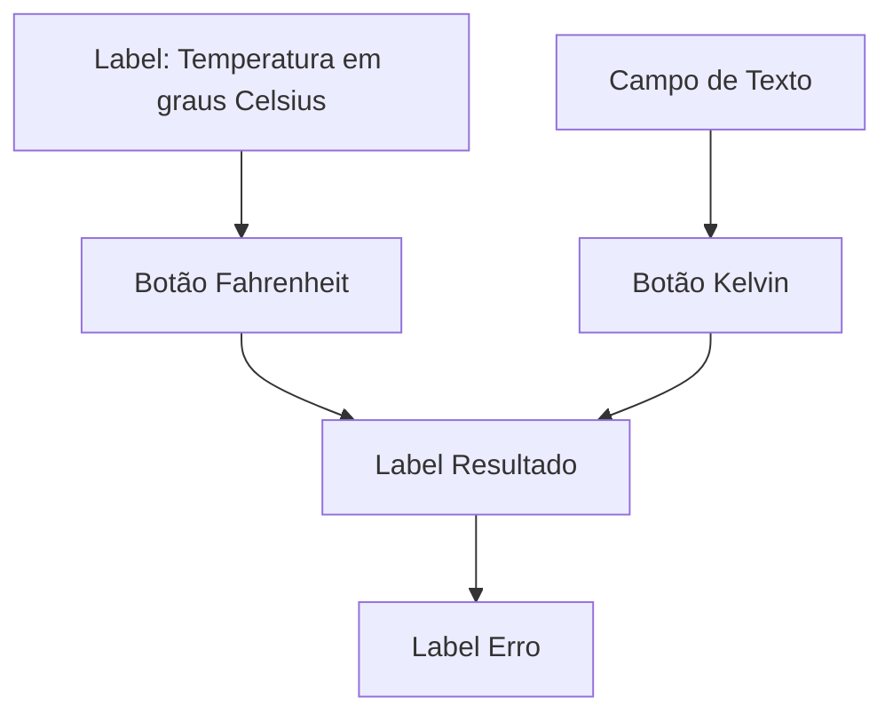

# Conversor-Temperatura
Essa tarefa foi ministrada pelo professor Celso na Aula de Lógica de Programação.

- Tempo levado: 1 hora
- Apenas na saula de aula
- Respeitando as regras estabelecidas(ou seja, sem HPC e neuroergonomia)

# Funcionamento
O projeto é dividido em três pacotes principais:

| Pacote | Conteúdo | Responsabilidade |
|:------:|:--------:|:----------------:|
| `senai.jandira.atividade` | `Main` | Inicializar a aplicação |
| `senai.jandira.atividade.gui` | `TelaConversor` | Interface gráfica da aplicação |
| `senai.jandira.atividade.model` | `Temperatura` | Lógica de conversão de temperatura |

---

# 📦 Arquitetura de Classes

Aqui está um **diagrama de classes** resumido para entender a estrutura:

---

# 🖥️ Funcionamento da Aplicação (Passo a Passo)

1. **Inicialização:**
    - A classe `Main` executa `TelaConversor` dentro do método `main` usando `SwingUtilities.invokeLater`.
    - Isso garante que a tela seja criada na **Thread de Interface Gráfica** (boa prática com Swing).

2. **Interface Gráfica:**
    - `TelaConversor` cria uma janela (`JFrame`) sem layout automático (`setLayout(null)`).
    - Coloca manualmente:
        - Um `JLabel` pedindo a temperatura em graus Celsius.
        - Um `JTextField` para o usuário digitar a temperatura.
        - Dois `JButtons`: um para converter para Fahrenheit, outro para Kelvin.
        - Dois `JLabels` para mostrar o **resultado** ou uma **mensagem de erro**.

3. **Quando o usuário clica num botão:**
    - Um **ActionListener** é chamado (`converterParaFahrenheit` ou `converterParaKelvin`).
    - O programa tenta ler o valor digitado:
        - Se for número → cria um objeto `Temperatura`, converte e mostra o resultado formatado.
        - Se der erro (ex: letras) → mostra uma mensagem de erro.
            - Não implementado reader e logica complexa, embora tenha visto possibilidade de implementar Machine Learnig

4. **Conversão de Temperatura:**
    - A classe `Temperatura` faz o cálculo matemático:
        - Celsius → Fahrenheit: `(°C × 9/5) + 32`
        - Celsius → Kelvin: `°C + 273.15`

---

# 🔄 Fluxo de Execução (Diagrama de Fluxo)

Aqui está um diagrama de fluxo simplificado:

---

# 📊 Organização da Janela

Visualmente, sua janela está estruturada assim:

---

# 🛠️ Técnicas Utilizadas

| Técnica | Descrição |
|:--------|:----------|
| Swing | Biblioteca gráfica do Java |
| Layout Manual (`null`) | Posicionamento fixo usando `setBounds` |
| MVC Simples | Separação em Model (`Temperatura`) e View (`TelaConversor`) |
| Exception Handling | Tratamento de erro de entrada inválida (`NumberFormatException`) |
| Thread-Safe GUI | Uso do `SwingUtilities.invokeLater` |
